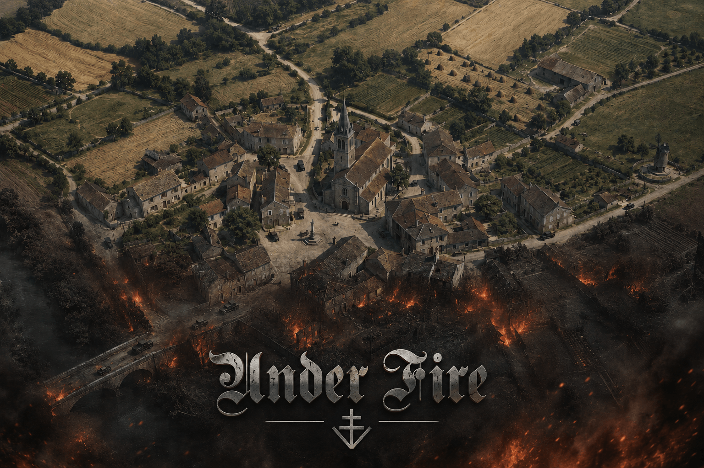

<p align="center">
  
</p>

<h1 align="center">Under Fire</h1>

<p align="center"><strong>A free, open, community-built World War II real-time tactics game. Built in the browser, with AI.</strong></p>

<p align="center">
  <a href="https://underfire.io">▶ Play</a>
  &nbsp;·&nbsp;
  <a href="https://discord.gg/jmkh3RDkF">💬 Discord</a>
  &nbsp;·&nbsp;
  <a href="CONTRIBUTING.md">Contribute</a>
  &nbsp;·&nbsp;
  <a href="vision.md">Vision</a>
</p>

<p align="center">
  <a href="https://discord.gg/jmkh3RDkF"></a>
</p>

---

Under Fire is a browser-based WW2 RTS in active, early development. It runs today: a 3D, individual-unit tactical battle with cover, suppression, line-of-sight, stance, armour penetration, squad AI, and a procedurally generated French-village battlefield. The bigger goal is a historically faithful platoon-to-battalion wargame spanning the whole of the Second World War — and it is being built in the open, by the community, with AI ("vibe") coding.

> Status: **work in progress.** Expect rough edges and missing pieces. That is the invitation, not the disclaimer.

---

## Play it

No build step. It is plain HTML, CSS, JavaScript and Three.js (loaded from a CDN).

```bash
# from the repo root
python3 -m http.server 8741
# then open http://localhost:8741
```

Any static file server works (`npx serve`, `php -S`, nginx, etc.). Opening `index.html` directly via `file://` may break ES-module and asset loading, so use a server.

### Controls

| Input | Action |
|-------|--------|
| Left click / drag | Select units |
| Right click | Move / attack-move |
| `Space` | Tactical pause (issue orders while paused; press again to resume) |
| `C` | Toggle crouch / stand |
| Crawl button | Go prone (harder to hit) |
| `WASD` / screen edge | Pan camera |
| Mouse wheel | Zoom |

---

## Help build it

This project exists to bring WW2 RTS fans into building the game they want. You do **not** need to be a professional engineer — describe what you want, let an AI assistant help you write it, test it, and open a pull request.

- **Start here:** [CONTRIBUTING.md](CONTRIBUTING.md) — how the code is laid out, where to add things, asset rules, and the contribution workflow.
- **The dream:** [vision.md](vision.md) — what we are aiming at and the design pillars.
- **Where it could go:** [docs/ROADMAP.md](docs/ROADMAP.md) — development paths (Three.js now → engine ports / custom engine / the neural-renderer ideal).
- **Maintainers / hosting / releases:** [docs/DEPLOYMENT.md](docs/DEPLOYMENT.md).

Good first areas: **models, scenery, textures, effects, sound, mechanics, and historical accuracy.** The systems exist; nearly all of them have room to get better.

---

## Tech at a glance

- **Three.js** (r0.180, via CDN importmap) for 3D rendering
- Vanilla JS — a global `Game` namespace of classic scripts plus one ES-module entry (`js/main.js`)
- Procedural terrain, meshes, animation, and effects; no asset pipeline required to run
- All bundled art/audio is **CC0 / public-domain** (see [CREDITS.md](CREDITS.md))

## Repository layout

```
index.html        Game shell: menu, HUD, CSS, script/importmap wiring
js/               Game code (see CONTRIBUTING.md for the per-file map)
models/           3D models (.glb)
textures/         Textures (textures/oga/ = CC0 OpenGameArt)
sounds/           Audio (sounds/rwm/ = public-domain clips + manifest)
fonts/            UI fonts
maps/             Map data
tools/            Asset/format utilities
docs/             Design notes, deployment guide, deep-dive docs
vision.md         Game vision
CONTRIBUTING.md   Contributor guide
LICENSE.md        Under Fire Community License (free, non-commercial)
CREDITS.md        Asset attributions
```

## License

Under Fire is free to play, study, modify and share for **non-commercial** use. You must credit **Under Fire**, you may not sell it or run ads on it, and you may not spin it off into a separate or commercial product — improvements come back here so everyone benefits. See [LICENSE.md](LICENSE.md) for the exact terms.
