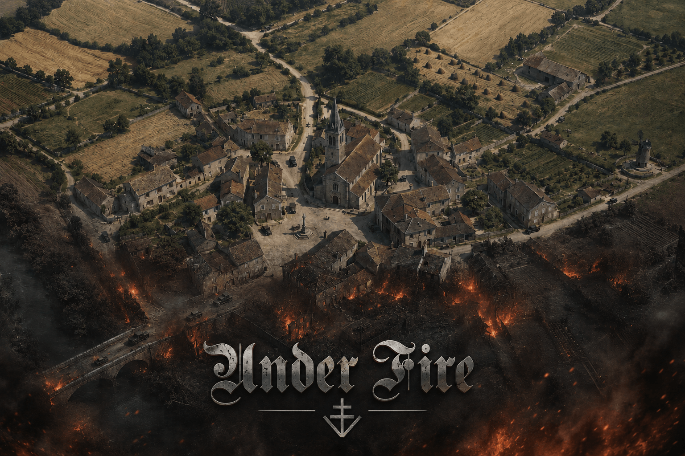

<p align="center">
  
</p>

<h1 align="center">Under Fire</h1>

<p align="center"><strong>A free, open, community-built World War II real-time tactics game. Built in the browser, with AI.</strong></p>

<p align="center">
  <a href="https://underfire.io">▶ Play</a>
  &nbsp;·&nbsp;
  <a href="https://discord.gg/jmkh3RDkF">💬 Discord</a>
  &nbsp;·&nbsp;
  <a href="CONTRIBUTING.md">Contribute</a>
  &nbsp;·&nbsp;
  <a href="vision.md">Vision</a>
</p>

<p align="center">
  <a href="https://discord.gg/jmkh3RDkF"></a>
</p>

---

Under Fire is a browser-based WW2 RTS in active, early development. Its first and default selected battle is the French-versus-German **Advance to the Dyle** scenario. **Mokra: Hold the Railway** is the second, Preview scenario, where the player commands Polish forces against Germany on 1 September 1939. Both run on the same individual-unit tactical simulation, with cover, suppression, line-of-sight, stance, armour penetration, squad AI, and 3D terrain. The bigger goal is a historically faithful platoon-to-battalion wargame spanning the whole of the Second World War — and it is being built in the open, by the community, with AI ("vibe") coding.

> Status: **work in progress.** Expect rough edges and missing pieces. That is the invitation, not the disclaimer.

---

## Play it

No build step. It is plain HTML, CSS, JavaScript and a vendored, pinned Three.js build. Production serves heavyweight models, textures, audio, video and baked map imagery through Bunny; localhost serves every file locally.

```bash
# from the repo root
python3 -m http.server 8741
# then open http://localhost:8741
```

Any static file server works (`npx serve`, `php -S`, nginx, etc.). Opening `index.html` directly via `file://` may break ES-module and asset loading, so use a server.

### Playable battles

- **Advance to the Dyle** — the first and default selected French-versus-German battle.
- **Mokra: Hold the Railway** — the second selection, currently labelled **Preview**. Command Poland's reinforced Wołyńska Cavalry Brigade against German armour and hold the railway crossing. See the [implementation record](docs/scenarios/mokra.md) and the complete [Poland 1939 campaign dossier](docs/POLAND_1939_CAMPAIGN.md).

The current Mokra slice covers a Polish defensive deployment, an appropriate early-war roster, the railway battlefield, and phased German attacks. A persistent white, top-centre three-minute countdown gives Poland time to redeploy before the German vanguard enters from the western map edge at 3:00; siren playback is temporarily disabled during testing. Later echelons enter at 3:55, 5:05, and 6:25, with victory after five combat minutes at 8:00 total elapsed time. Its deliberately compressed opening line alternates three 37 mm Bofors anti-tank guns with three 75 mm field guns; five five-man infantry sections occupy the gaps, with a full eight-man reserve squad, two HMGs, and one each of the 46 mm and 81 mm mortars. This is a playable vertical-slice allocation, not the full brigade establishment described in the campaign dossier.

Polish commands use 75 unique active assets from 77 supplied recordings. Infantry pools contain 16 selection, 30 movement, 6 core-attack, and 18 morale/patriotic takes; tank pools reuse vehicle-neutral recordings in pools of 15 selection, 17 movement, 5 core-attack, 18 shared vehicle-safe morale/patriotic, and 8 stop takes. The first accepted Polish infantry or tank attack order, then every third attack order after it, uses the relevant morale pool. Attack-move and attack-ground orders use attack semantics, while drag-box selection emits one aggregate acknowledgement. The final German Mokra echelon forces one `nie-zlamia-nas` cue.

Only `formal-variants/oddzial-gotow-panie-kapitanie` and `patriotic/za-warszawe` remain reserved. Dedicated vehicle-crew recordings are still desirable, but Polish tanks are not silent. The four mounted reserve Ułans can dismount, leaving persistent riderless horses that cannot be controlled; a linked foot Ułan must walk back to its horse through the enter-style interaction before remounting. Horse-artillery limbers, Armoured Train No. 53 *Śmiały*, the scripted Ju 87 phase, and the protected withdrawal remain documented future work.

### Controls

| Input | Action |
|-------|--------|
| Left click / drag | Select units |
| Right click | Order: **Move** or **Attack-Move** per the stance switch (Orders panel); right-clicking an enemy attacks it |
| Double right-click | **Retreat** — break off and fall back (infantry sprint, tanks reverse) |
| `E` | Toggle Move / Attack-Move stance |
| `F` | Attack ground (suppress a spot) |
| `Ctrl+0–9` / `0–9` | Assign / recall control groups |
| `V` / `H` | Stop / Hold fire |
| `U` / `M` / `K` | Sapper: build sandbags / lay mine / TNT |
| `O` / `L` | Tow a gun / Load–unload troops (vehicles & trucks) |
| `Space` | Tactical pause (issue orders while paused; press again to resume) |
| `C` | Cycle stance (run / walk / crouch / crawl) |
| `WASD` / screen edge | Pan camera · Mouse wheel zoom |

Towed guns (AT guns, heavy MGs) deploy/limber automatically: they set up to fire and pack up when ordered to move.

### Debug panel

Press `` ` `` (backtick) in-game to toggle the **Debug Controls** panel. It has live sliders for:

- **Terrain** — height scale, smoothing, bump/roughness/metalness, texture filter and scale, flat shading (then **Rebuild Terrain**)
- **Lighting / Water / Camera** — sun and ambient, cloud shadows, water level/opacity/roughness, camera tilt and zoom range
- **Tank Model** — pick a model and **Scan Nodes** to inspect its mesh hierarchy
- **Post-processing** — anti-aliasing (SMAA), the render **upscaler**, bloom, tilt-shift depth-of-field, colour grading (hue/saturation, brightness/contrast), vignette, and live **lighting** (sun / ambient / cloud shadows)

Each post-processing control has a slider *and* a typeable number box. Retune the look live, then click **Copy values** to copy the current settings to the clipboard (a `postfx = { … }` block including lighting) so you can drop them into an issue, a PR, or a chat.

---

## Help build it

This project exists to bring WW2 RTS fans into building the game they want. You do **not** need to be a professional engineer — describe what you want, let an AI assistant help you write it, test it, and open a pull request.

- **Start here:** [CONTRIBUTING.md](CONTRIBUTING.md) — how the code is laid out, where to add things, asset rules, and the contribution workflow.
- **The dream:** [vision.md](vision.md) — what we are aiming at and the design pillars.
- **Where it could go:** [docs/ROADMAP.md](docs/ROADMAP.md) — development paths (Three.js now → engine ports / custom engine / the neural-renderer ideal).
- **Maintainers / hosting / releases:** [docs/DEPLOYMENT.md](docs/DEPLOYMENT.md).

Good first areas: **models, scenery, textures, effects, sound, mechanics, and historical accuracy.** The systems exist; nearly all of them have room to get better.

## Found a bug? Have feedback?

Please report it — it genuinely helps. The game is early and rough, so bug reports are some of the most valuable contributions you can make.

- **Report a bug or request a feature:** [open an issue](https://github.com/tksa/underfire/issues/new/choose) (there are quick templates for both).
- **Browse known issues first:** [existing issues](https://github.com/tksa/underfire/issues).
- **Prefer to chat?** Drop it in [Discord](https://discord.gg/jmkh3RDkF) and we'll log it.

When reporting a bug, a sentence on what you did, what you expected, and what happened (plus your browser/OS) is plenty. Screenshots or a clip help a lot.

---

## Neural terrain (experimental)

Under Fire's terrain can be re-rendered photorealistically by a diffusion
model trained on this game's own maps. Both the model and its training data
are published openly:

- **Model**: [tstruk/under-fire-terrain-controlnet](https://huggingface.co/tstruk/under-fire-terrain-controlnet)
  — a Stable Diffusion 1.5 ControlNet (game render in, aerial photo out)
- **Dataset**: [tstruk/under-fire-terrain-pairs](https://huggingface.co/datasets/tstruk/under-fire-terrain-pairs)
  — 600 CC0 training pairs plus the full generation prompt

The default map ships pre-baked, so playing needs no ML setup at all. To bake
maps yourself you run the small inference server locally (CUDA GPU with ~8 GB
free recommended):

```bash
pip install torch diffusers transformers accelerate spandrel pillow numpy
python scripts/infer_server.py        # downloads the model, serves on :8788
```

Then in the game: press backtick (`) to open the debug panel — the **Neural
Terrain** section at the top has everything:

- **New Procedural** generates a fresh random map
- **Bake Neural Map** re-renders the whole map through the model (~2-4 min);
  **Bake View** previews just the visible area in ~20 s
- Prompt, negative prompt, steps, guidance, seed and post-processing knobs are
  all in the panel; **Map** save/load keeps named maps with their bakes
### Map Maker

The debug panel's **Map Maker** section is a full in-game terrain editor:

- **New Blank Map** starts an all-grass canvas (with a confirm so you can't
  lose work by accident); or paint straight over any procedural map
- **Painting: ON** captures the mouse for the brush: left-drag paints, camera
  keys still work. In **freeform** mode you paint at texture resolution like a
  real brush (smooth curves, live preview); **tiles** mode snaps to the game
  grid. Brush **size**, **circle/square shape**, **soft edge** (organic ragged
  rim) and **round edges** (melts staircase corners) are all in the panel,
  plus a **line** tool for straight field boundaries
- The palette covers every terrain type (crops, forest, water, roads, cobbles,
  walls) plus **+/- fluff** brushes to place or clear animated grass and wheat
  cover; the **Fluffy Grass** section tunes density, height, width, lean,
  patchiness, colours and wind per species
- **Rebuild World** turns your painted tiles into full 3D: fences and hedges
  grow along field boundaries, forests fill with trees, water gets its carved
  bed, banks and animated surface, roads flatten
- **Undo** steps back per stroke; **Map** save/load keeps named maps (with
  their bakes) in the browser, and **Export** produces the `map.json` +
  `bake.jpg` pair used to bundle a map with the game (`maps/default/`)

Painted maps bake through the neural pipeline exactly like procedural ones.

The animated grass/wheat cover is inspired by
[thebenezer/FluffyGrass](https://github.com/thebenezer/FluffyGrass)
(reimplemented from scratch for this engine).

Neural terrain stands on:

- [Stable Diffusion 1.5](https://huggingface.co/stable-diffusion-v1-5/stable-diffusion-v1-5)
  (CreativeML OpenRAIL-M) — the frozen base model our ControlNet steers
- [ControlNet](https://github.com/lllyasviel/ControlNet) (Zhang et al.) — the
  conditioning architecture, via [diffusers](https://github.com/huggingface/diffusers)
- [Real-ESRGAN](https://github.com/xinntao/Real-ESRGAN) (BSD-3) — the optional
  2x upscale pass
- OpenAI `gpt-image-2` — generated the photorealistic training targets

Capture geometry note: the published dataset and models were trained on
tilted views captured at camera tilt **35 degrees** (zoom 20), while the
game's default camera tilt is now **45 degrees**. Reproducing the tilted
capture distribution means pinning tilt back to 35 (debug panel, Camera
section); the top-down ortho capture mode is unaffected.

The game looks for the server on `http://127.0.0.1:8788`. To point it at a
different machine: `localStorage.setItem('uf_neural_url', 'http://host:8788')`
in the browser console, once.

## Tech at a glance

- **Three.js** (r0.180, vendored and pinned through the importmap) for 3D rendering
- **Postprocessing** ([pmndrs/postprocessing](https://github.com/pmndrs/postprocessing), vendored) — bloom, tilt-shift depth-of-field, colour grading, vignette, SMAA, plus an FSR-like render upscaler; all tunable live in the debug panel
- **Bunny CDN in production** for heavyweight public assets, with same-origin localhost fallback and the purge/verification procedure in [`docs/CDN.md`](docs/CDN.md)
- **Procedural trees & hedges** via [EZ-Tree](https://github.com/dgreenheck/ez-tree) (geometry only), rendered with CC0 oak bark + leaf textures
- Vanilla JS — a global `Game` namespace of classic scripts plus one ES-module entry (`js/main.js`)
- **Per-unit logic split into modules** (`js/unit_modules.js`: move/fire/scan/health/morale/deploy/…) behind a thin `updateUnit` orchestrator
- **Data-driven units** — `data/units.csv` is the editable roster (614 units, with per-unit `year` for era gating), merged over the built-in table at boot
- Procedural terrain, meshes, animation, and effects; no asset pipeline required to run
- Asset provenance and licences are recorded in [CREDITS.md](CREDITS.md). Most third-party assets are CC0/public-domain, while the user-provided Polish voices are documented separately and are not claimed there as CC0 or public domain.

## Repository layout

```
index.html        Game shell: menu, HUD, CSS, script/importmap wiring
js/               Game code (see CONTRIBUTING.md for the per-file map)
data/             Editable game data: units.csv (roster), changelog.json
models/           3D models (.glb)
textures/         Textures (textures/oga/ = CC0 OpenGameArt)
sounds/           Audio (public-domain RWM bank plus Polish voices in sounds/voices/pl/)
fonts/            UI fonts
maps/             Map data
tools/            Asset/format utilities
docs/             Design notes, deployment guide, deep-dive docs
vision.md         Game vision
CONTRIBUTING.md   Contributor guide
LICENSE.md        Under Fire Community License (free, non-commercial)
CREDITS.md        Asset attributions
```

## License

Under Fire is free to play, study, modify and share for **non-commercial** use. You must credit **Under Fire**, you may not sell it or run ads on it, and you may not spin it off into a separate or commercial product — improvements come back here so everyone benefits. See [LICENSE.md](LICENSE.md) for the exact terms.
